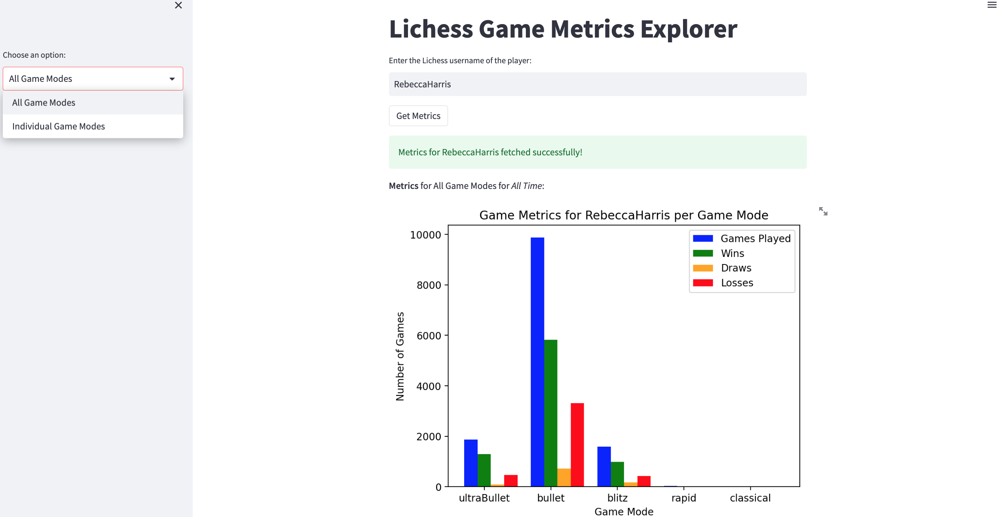
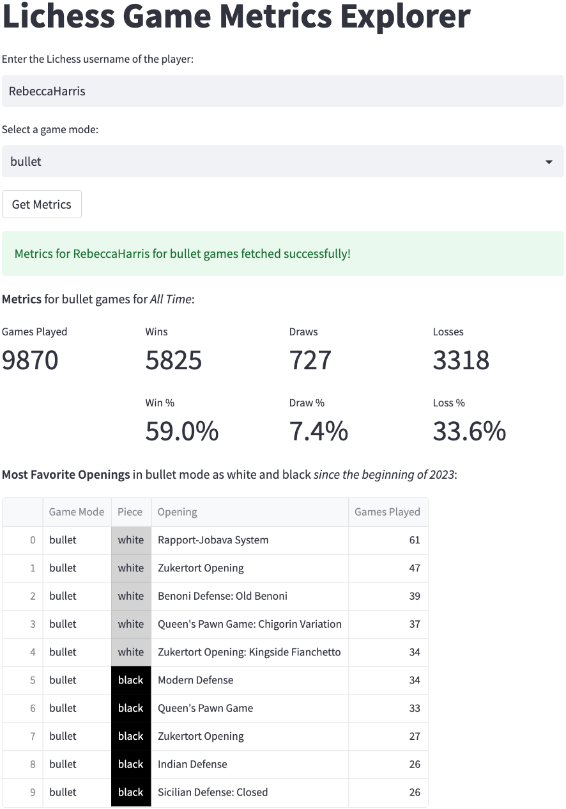
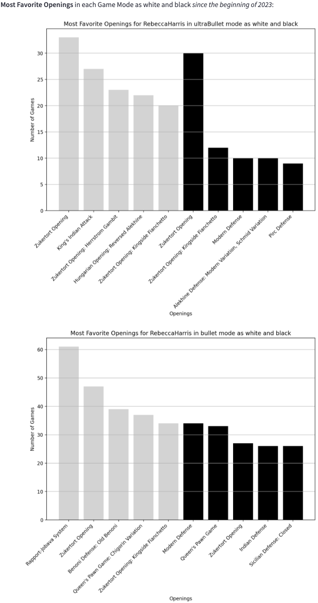

# Lichess Game Metrics Explorer
<p align="justify">
    A simple web application written in Python using <a href="https://streamlit.io/">Streamlit</a> framework to explore a chess player's game metrics on <a href="https://lichess.org/">Lichess</a>. The metrics include the player's total number of games, wins, draws, losses and most favorite openings as white and black for each game mode ultraBullet, bullet, blitz, rapid and classical. I used <a href="https://lichess.org/api">Lichess API</a> to fetch data, and wrote my own functions to process the data (e.g., converting a <a href="https://en.wikipedia.org/wiki/Portable_Game_Notation">PGN</a> file to a Pandas DataFrame), so no need to load any dataset or a csv file, or install any chess libraries.
</p>

<p align="center">
  
  
  &nbsp;&nbsp;
   
</p>

## How to run
```
git clone https://github.com/amrznik/lichess-metrics
cd lichess-metrics
pip install -r requirements.txt
streamlit run main.py
```
or without cloning the repo:
```
pip install -r requirements.txt
streamlit run https://raw.githubusercontent.com/amrznik/lichess-metrics/main/main.py
```
(optional: it's good to first create a new [Python virtual environment](https://docs.python.org/3/library/venv.html), activate it and then do the above)

## Contribution
Feel free to contribute by adding new metrics/features to the app. Simply fork, create a pull request, and I'll do the rest.